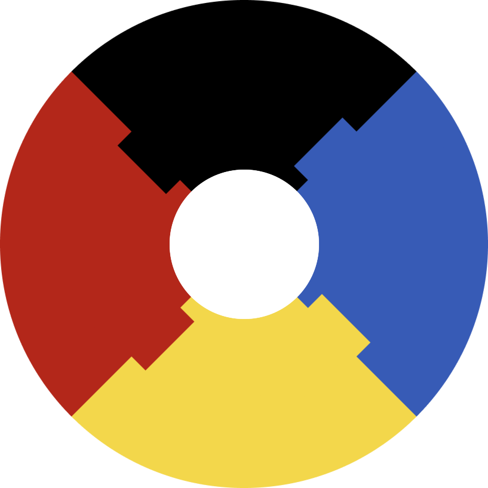

<p align="center">
 
</p>

# Джеджалик

Швидкий компілятор Мавки для вебу.

```c++
#include <string>
#include "jejalyk.cpp"

std::string get_module_name(bool relative, std::string module, jejalyk::CompilationOptions* options) {
    // ...
}

std::string get_module_path(bool relative, std::string module, jejalyk::CompilationOptions* options) {
    // ...
}

std::string get_module_code(bool relative, std::string module, jejalyk::CompilationOptions* options) {
    // ...
}

std::string get_butintin_module_code(std::string module, jejalyk::CompilationOptions* options) {
    // ...
}

std::string get_remote_module_name(std::string module, jejalyk::CompilationOptions* options) {
    // ...
}

std::string get_remote_module_pak_path(std::string module, jejalyk::CompilationOptions* options) {
    // ...
}

std::string get_remote_module_path(std::string module, jejalyk::CompilationOptions* options) {
    // ...
}

std::string get_remote_module_code(std::string module, jejalyk::CompilationOptions* options) {
    // ...
}

int main() {
    const auto options = new jejalyk::CompilationOptions();
    options->root_module_path = "./";
    options->current_module_path = "./";
    options->get_module_name = &get_module_name;
    options->get_module_path = &get_module_path;
    options->get_module_code = &get_module_code;
    options->get_butintin_module_code = &get_butintin_module_code;
    options->get_remote_module_name = &get_remote_module_name;
    options->get_remote_module_pak_path = &get_remote_module_pak_path;
    options->get_remote_module_path = &get_remote_module_path;
    options->get_remote_module_code = &get_remote_module_code;

    const auto result = jejalyk::compile("друк(\"Привіт від Івана!\")", options);
    if (result->parser_error) {
        std::cout << result->parser_error->message << std::endl;
    } else if (result->error) {
        std::cout << result->error->message << std::endl;
    } else {
        std::cout << result->result << std::endl;
    }

    return 0;
}
```